# Art-Senpai
A HTML5 and CSS3 based website aimed to replicate the basic functionality of an online art gallery

Final Project for Internet and Web Programming course offered by Computer Science department at Christ University Faculty of Engineering.

Done by Basil George Poulose, Nikhil Niranjan, Karthik Krishna.

# Technologies Used
* HTML5
* CSS3
* JavaScript
* PHP
* Database - MySQL through PHPMyAdmin
* Remote server for hosting - Apache

# Screenshots
 

 
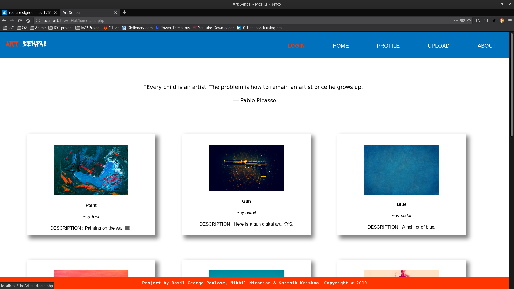
 
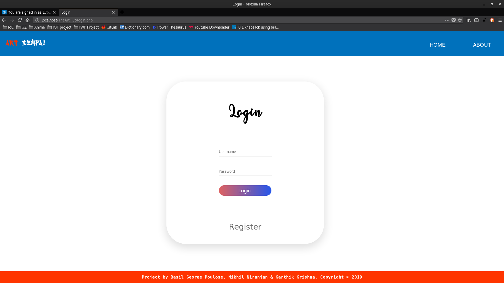
  
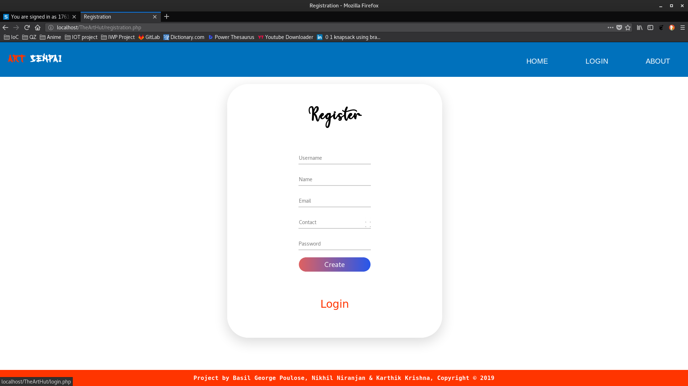
  
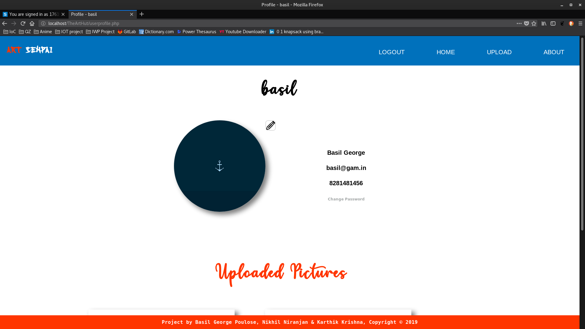
  
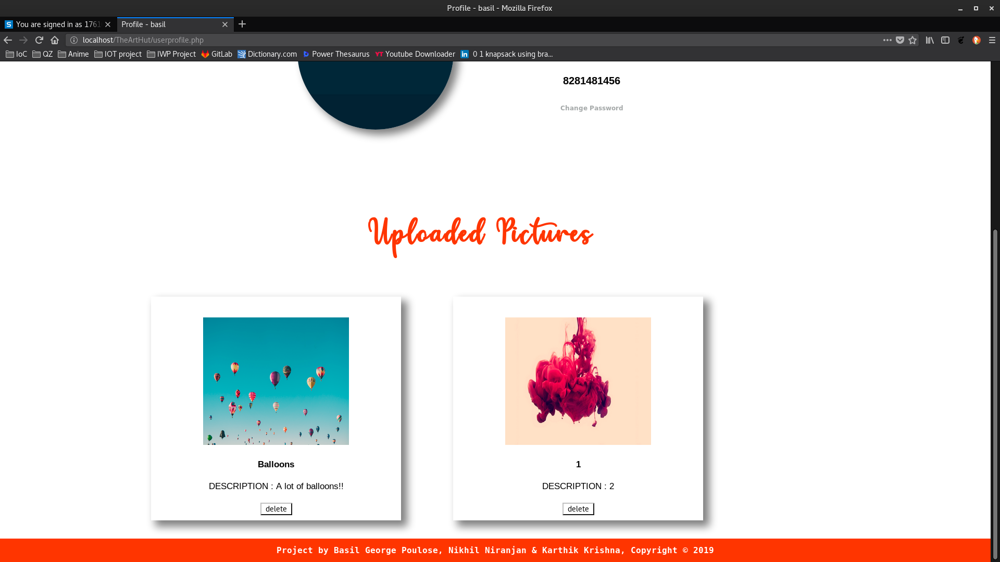
  
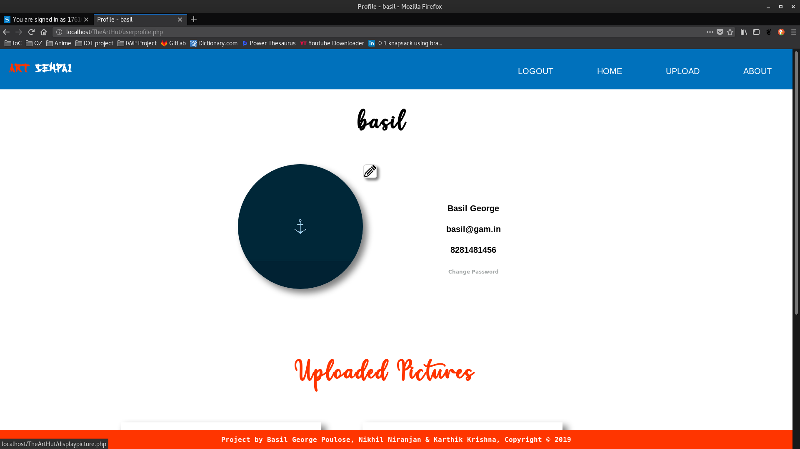
  
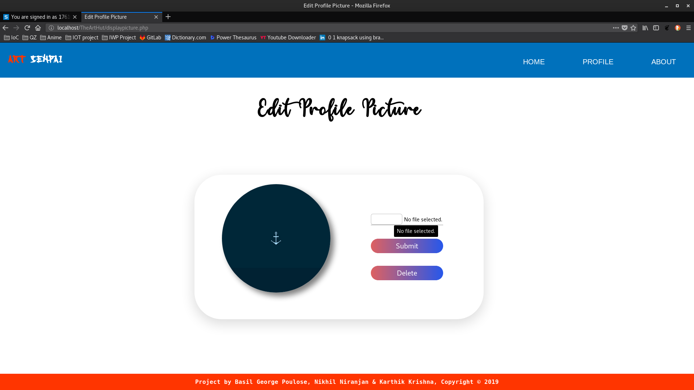
  
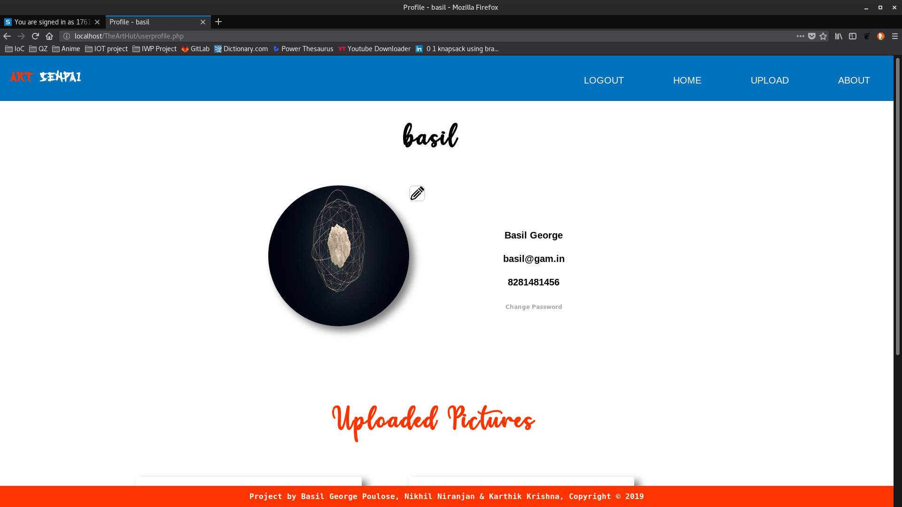
  
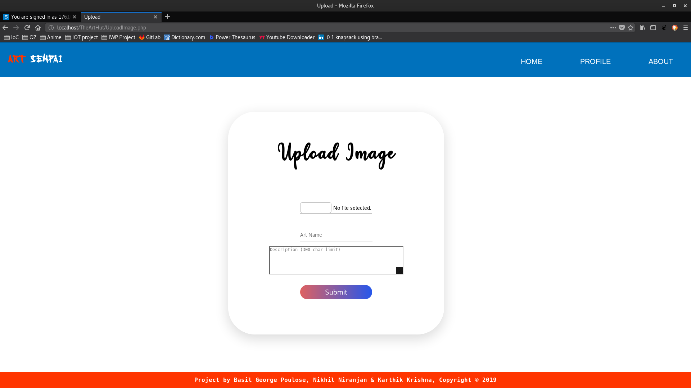
  
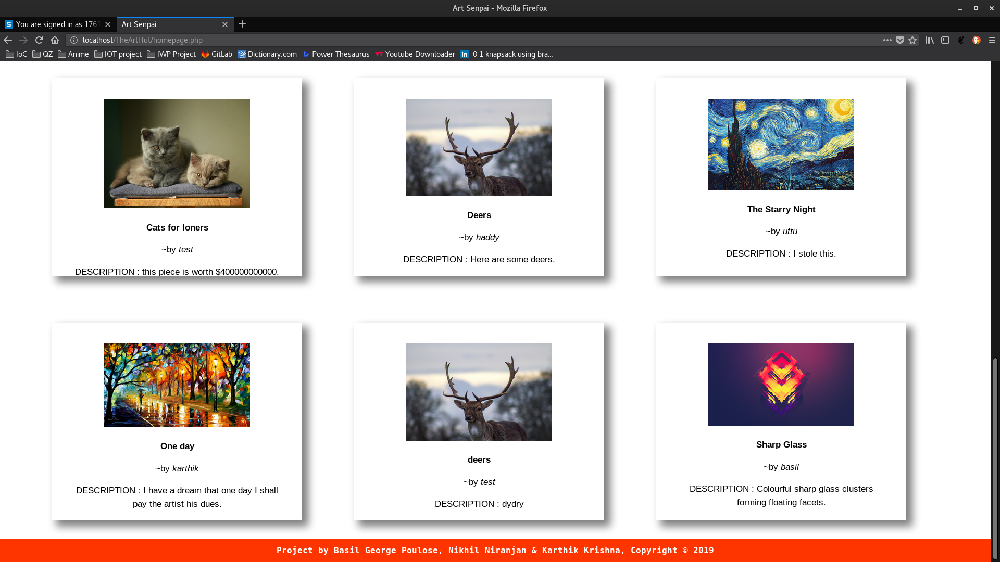
  
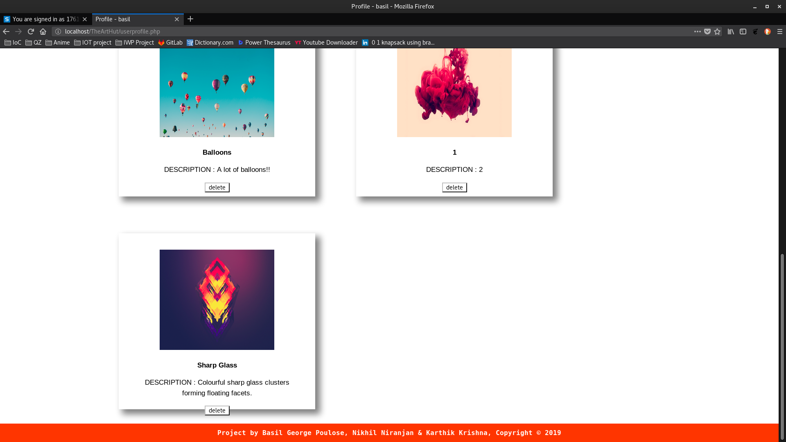
  

  
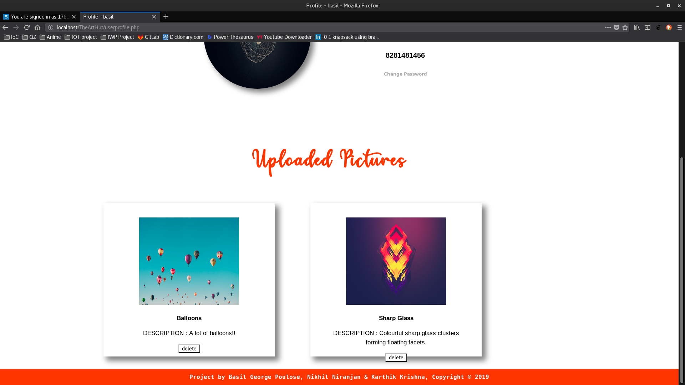
  
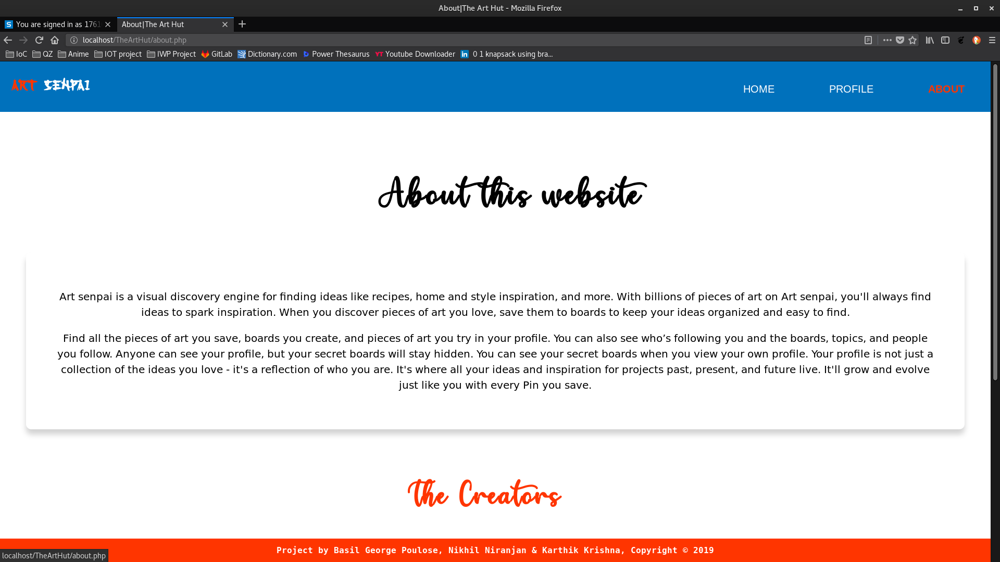
  
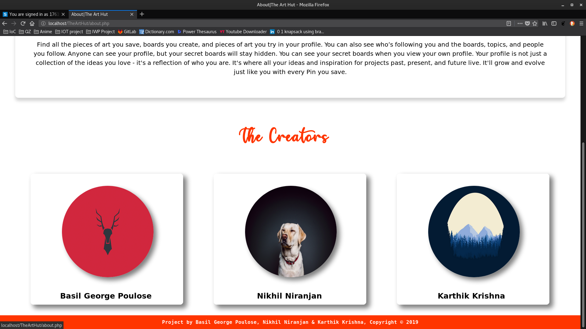
  
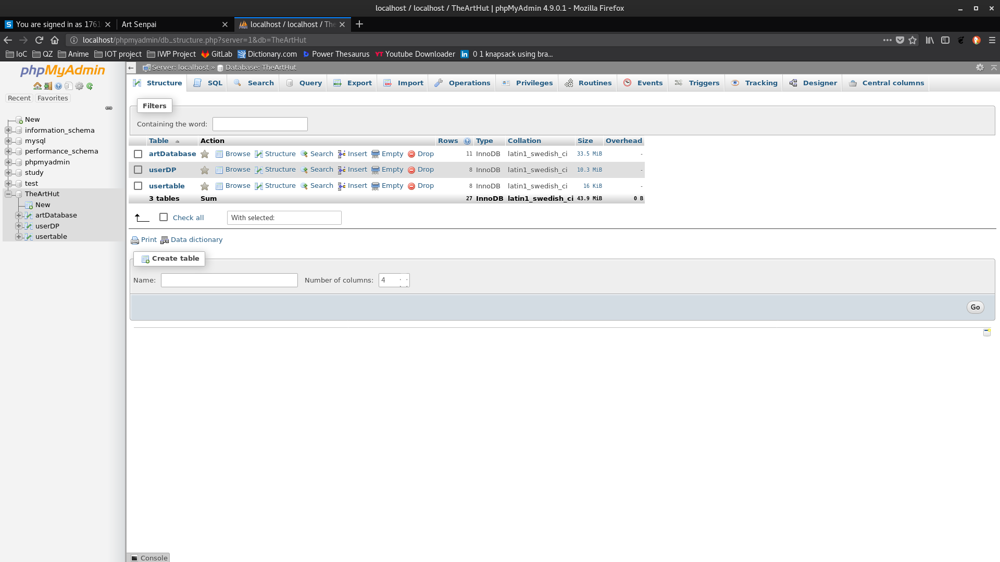
  
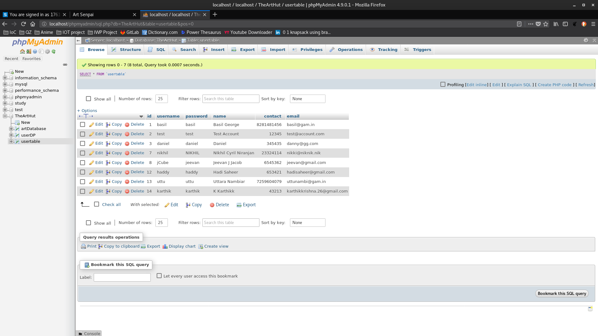
  
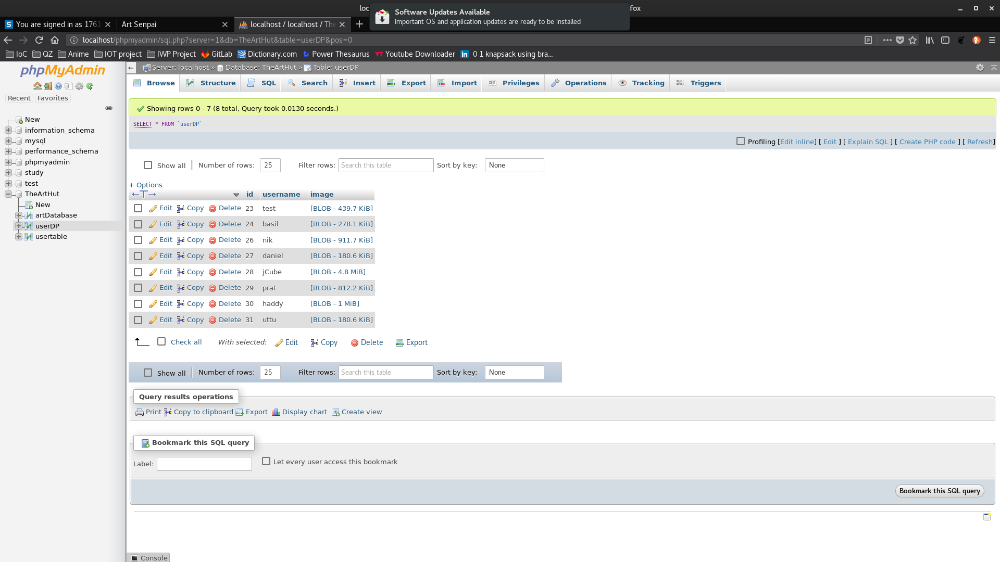
  
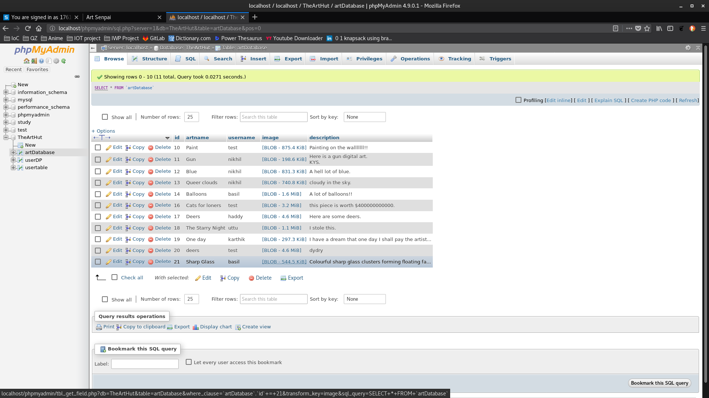
 
